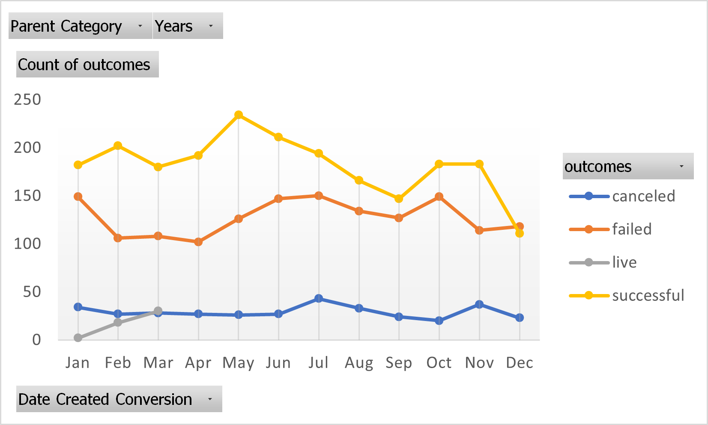
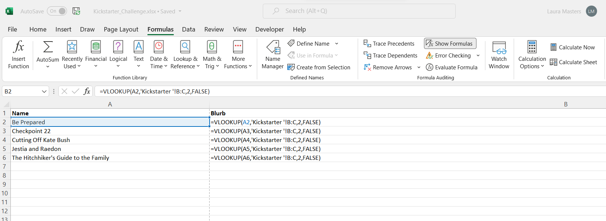

# Kickstarting with Excel

## Overview of Project
    The overview of this project was to conduct an analysis of crowdfunding data to kickstart a play.  By using exel functions, charts and tools, we were able to determine the outcomes of  financial campaigns for specific plays. 

### Purpose
    The purpose of the project was to use specific excel functions to narrow down and compare a smaller subset of data to make it more workable.   By filtering and comparing smaller sets of data, we were able to determine what play would be best for Louise based on the success or failure of pledged donations.  

## Overview of Analysis 
   I began the analysis of the data by looking at the overall Kickstarter spreadsheet and determining what kind of information was being compared by looking at the column headers.  Within each step of the module, I was able to follow along and match the data displayed in the example to check my progress.  The data was easy to filter to obtain a greater understanding of each category such as the overall outcome of a particular play as determined by a particular amount of money raised.  By creating pivot tables and various types of charts within the subset of the data, I was able to get more a visual understanding of the results and therefore was able to draw a better conclusion as to what categories were most successful. 

### Analysis of Outcomes Based on Launch Date
	Following the creation of the pivot chart and line graph from filtering the outcomes based by month I was able to get a better sense of the data over the course of the entire year.  It can be noted in my screenshot of the chart below that the greatest number of successful outcomes occured in May while the greatest number of failed outcomes occured in January.  It can also be noted that there are several months in which the failed outcomes are within a few numbers of eachother. 
  
  

### Analysis of Outcomes Based on Goals
	After troubleshooting my issue with the COUNTIFS formula, I was able to successfully create the line based graph showing the outcomes based on goals.  The thing that struck me most about this particular breakdown of the data was that there were no cancelled outcomes throughout each range.  Based on the data, it can be noted that the majority of the successful and failed campaign goals occured between the range of less than $1,000 raised and between the range of $1,000 to $4,999 raised.    

### Challenges and Difficulties Encountered
 As is the case when learning new things, this analysis had its fair share of challenges.  While I am familiar with most functions of excel such as basic filtering, sorting and calculating the sum of a certain column, I have never used pivot charts and tables or more specific formulas like VLOOKUP and COUNTIFS.
    The first challenge I encountered was with the Edinburgh Research sheet which had us using VLOOKUP to pull data from the Kickstarter spreadsheet to populate selected with data from specific cells from the Kickstarter spreadsheet.  After countless errors within the formula, I decided to erase the cells and start again.  Despite copying the formula exactly how it was written on the module, I kept getting a formatting error where I could somehow only see the formula and not the data, as in the case with the image displayed below:
    
         
    
    I countinued to troubleshoot the issue but kept encountering the same issue for hours, so I decided to turn to google to see if I could resolve the issue.  Unfortunately I was unable to resolve the issue on my own, so I turned to Office Hours before class to help troubleshoot the issue.  After going through several suggestions from my classmates, it was the TA, Cam who ultimately identified that there was a setting that was checked that made it so the cells would only show the formula instead of the data.  After overcoming that hurdle, I was able to continue to continue populating the data and obtain the correct results accordingly. 
    The second challenge I encountered was with the COUNTIFS function.  This issue proved to be a bit more time consuming as it was using a function of excel that I had never heard of and one that we had not gone over in class just yet.  The only information I had was from the module and from using google when I encountered an issue.  The first data cell in the Outcomes Based On Goals sheet, B2, came easy as it was a simple range.  The second cell however was a larger range and I kept getting no results.  After consulting the module and google and a few youtube videos, I was able to successfully determine that the syntax of my formula was off and then once the error was fixed, I was able to finish the rest of the analysis with the end result being a pivot chart that matched that of the example.

## Results
	As referenced above in my analaysis of the outcomes based on launch date, I concluded that the greatest number of sucessful outcomes occured in the month of May, while the least number of successful outcomes occured in December.  It can also be noted that there is a significant difference between the numbers of cancelled outcomes vs. failed or successful.  
	In regards to the outcomes based on goals, it can be concluded that highest percentage of successful plays occured with a goal within a range less than $1,000.  In contrast, the larger the range of the goal, the greater the percentage of failure.  It is also interesting to note that there are no cancelled outcomes within all the ranges of the goals. 
	I would have to say that one of the limitations of I see within this dataset is bias.  Whether it be from a staff personal pick or a financial goal in correlation with a particular play's sucess or failure.  Second, it appears that a limitation of the data is that it could be considered skewed based upon the fact that the theatre category has significantly more data than any other category.  
	In order to get a better understanding of the percentage of success vs. failure we could creat a pie chart which would display the data in sections.  A bar chart would also offer a better comparison of the goal between the categories.
